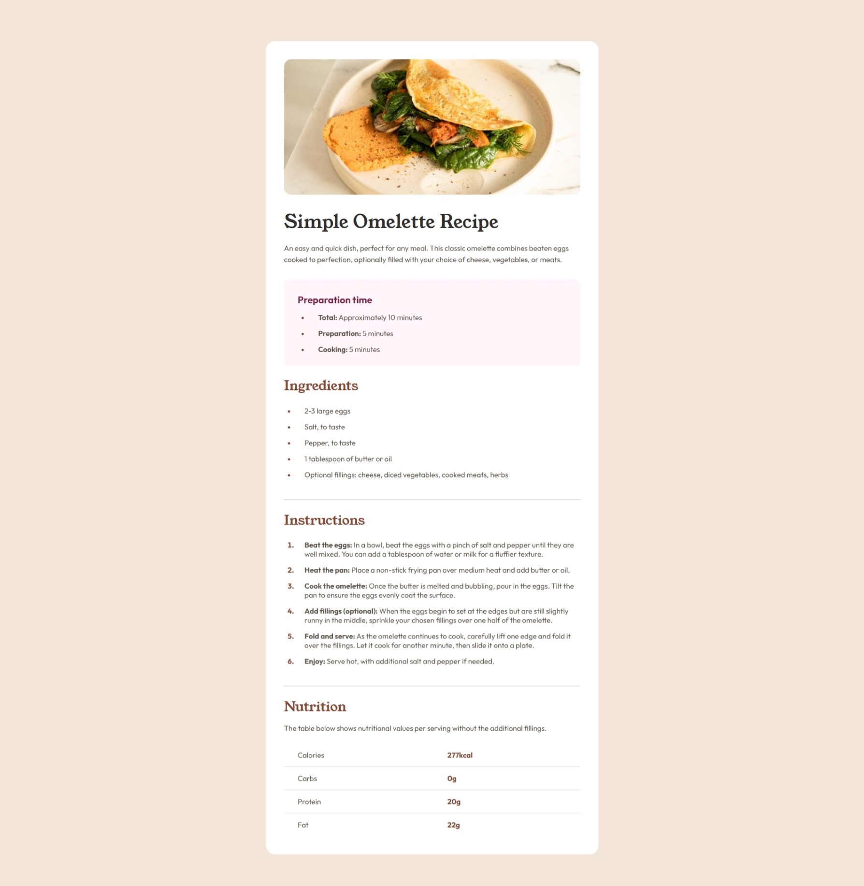

# Frontend Mentor - Recipe page solution

This is a solution to the [Recipe page challenge on Frontend Mentor](https://www.frontendmentor.io/challenges/recipe-page-KiTsR8QQKm). Frontend Mentor challenges help you improve your coding skills by building realistic projects. 

## Table of contents

- [Overview](#overview)
  - [Screenshot](#screenshot)
  - [Links](#links)
- [My process](#my-process)
  - [Built with](#built-with)
  - [What I learned](#what-i-learned)
- [Author](#author)

## Overview

### Screenshot

### Links

- Live Site URL: [https://recipe-page-taki.netlify.app/](https://recipe-page-taki.netlify.app/)

## My process

### Built with

- Semantic HTML5 markup
- CSS custom properties
- Flexbox
- Git

### What I learned

I learn responsive CSS, and pseudo elements.
And I experience the web dev workflow.

## Author

- LinkedIn - [Youssef TAKI](https://www.linkedin.com/in/youssef-taki-tech)
- Frontend Mentor - [@YoussefTK35](https://www.frontendmentor.io/profile/YoussefTK35)